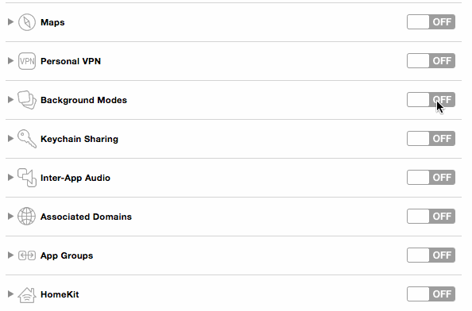

React Native: Beacons (iOS and Android)
======

## How to install

Assuming you already have:
- `NodeJS >= 6.x`
- `React Native` tools ([React Native website will explain better than me what it is about](https://facebook.github.io/react-native/docs/getting-started.html))

Steps to install:
- clone this repository
- install all npm dependencies
  ```bash
  npm install
  ```
- integrates dependencies in iOS and Android projects
```bash
react-native link
```

## iOS:
- iOS 8.0 minimum

> Don't forget to active Bluetooth and localization service on your device

*Note: this example app is already configured:*


## Android:
- target :
  - minimum to 21 `minSdkVersion` (*which means: android 5.0 LOLLIPOP*)

> Don't forget to active Bluetooth on your device (already done for you in this project)

## Beacon:

Any beacon should work just enter the right `uuid`.

#### You have no beacon... but you have an alternate iOS device, great!

This device can become your beacon like emitter thanks to [HiBeacons](https://github.com/nicktoumpelis/HiBeacons)
